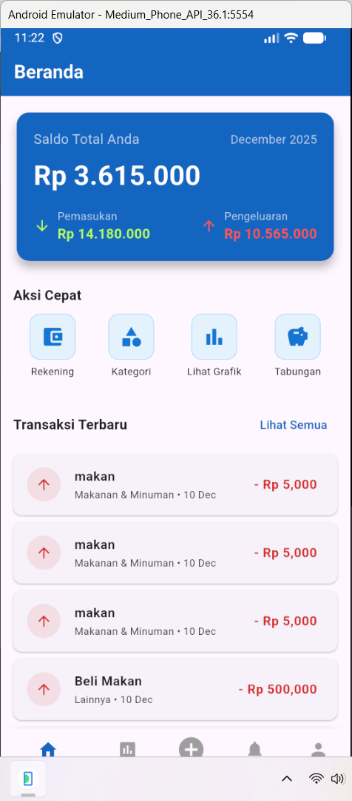
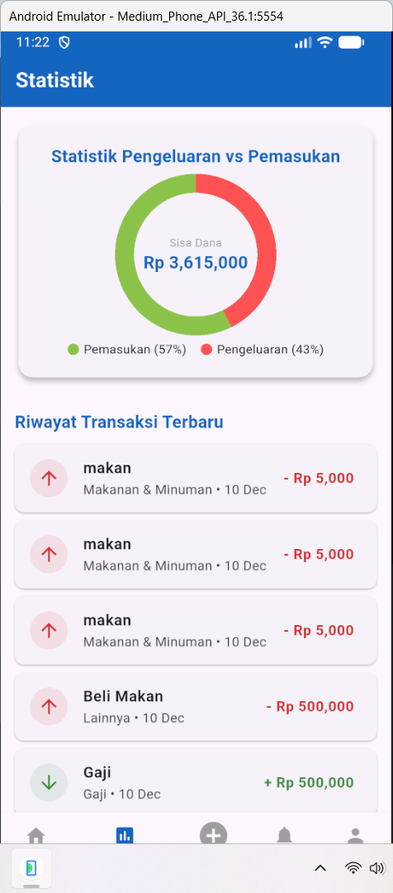

# Genggam Dana - Aplikasi Manajemen Keuangan


Aplikasi Flutter untuk mengelola keuangan pribadi dengan Firebase.

## 📸 Screenshots
| Beranda | Statistik | Login |
|---------|-----------|-------|
|  |  |  |

## ✨ Fitur Utama
- ✅ Login/Register dengan Firebase Auth
- ✅ Catat pemasukan & pengeluaran
- ✅ Dashboard dengan statistik real-time
- ✅ Grafik visualisasi keuangan
- ✅ Manajemen kategori transaksi
- ✅ Notifikasi sistem anggaran
- ✅ Keamanan dengan Firebase

## 🚀 Cara Menjalankan
```bash
# Clone repository
git clone [https://github.com/Andikafirdaus/aplikasi-manajemen-keuangan-genggam-dana.git](https://github.com/Andikafirdaus/aplikasi-manajemen-keuangan-genggam-dana.git)

# Masuk ke folder
cd genggam-dana

# Install dependencies
flutter pub get

# Run aplikasi
flutter run


